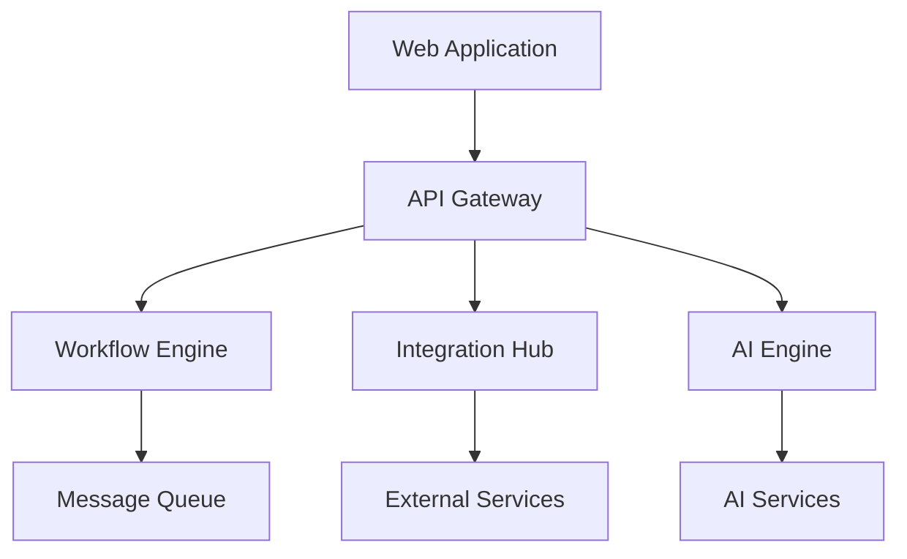

# Enterprise Workflow Automation Platform

[](https://github.com/workflow-automation/platform/actions)
[](https://codecov.io/gh/workflow-automation/platform)
[](https://snyk.io/test/github/workflow-automation/platform)
[](https://security.workflow-automation.com/compliance)
[](https://security.workflow-automation.com/compliance)
[](LICENSE)

Enterprise-grade no-code/low-code workflow automation platform enabling business users to create, deploy, and manage automated processes without programming expertise.

## Overview

The platform provides a visual interface for workflow design with extensive integration capabilities, addressing the growing need for business process automation while reducing technical barriers and implementation costs. Built for enterprise organizations, it offers:

### Key Features
- Visual Flow Editor with drag-and-drop capabilities
- 40+ pre-built enterprise service connectors
- AI-powered automation capabilities
- Real-time execution monitoring
- Enterprise-grade security and compliance

### Enterprise Capabilities
- SOC2 and HIPAA compliance
- Role-based access control (RBAC)
- Audit logging and compliance reporting
- High availability and disaster recovery
- Enterprise SLA with 99.9% uptime

### Architecture Overview



### Technology Stack
- Frontend: React 18.2.0, TypeScript 5.0
- Backend: Go 1.21, Node.js 20 LTS, Python 3.11
- Infrastructure: Docker 24.0.6, Kubernetes 1.28
- Databases: PostgreSQL 15.0, Redis 7.2
- AI: OpenAI API, Vector Store (Pinecone)

## Prerequisites

- Node.js 20 LTS
- Go 1.21
- Python 3.11
- Docker 24.0.6
- Kubernetes 1.28
- SSL/TLS certificates
- Security requirements:
  - SOC2 compliance
  - HIPAA compliance
  - Network security controls
  - Data encryption capabilities

## Installation

### Secure Enterprise Deployment

```bash
# Clone repository with security checks
git clone https://github.com/workflow-automation/platform.git
cd platform

# Verify dependencies and security
./scripts/security-check.sh

# Configure secure environment
cp .env.enterprise.example .env
# Edit .env with your secure configuration

# Deploy with security controls
./deploy/secure-deploy.sh
```

### Security Configuration Template

```yaml
security:
  encryption:
    at_rest: AES-256-GCM
    in_transit: TLS-1.3
  authentication:
    oauth2: true
    mfa: required
    session_timeout: 1h
  compliance:
    soc2: enabled
    hipaa: enabled
    audit_logging: enabled
```

## Configuration

### Security Settings
- OAuth 2.0 authentication configuration
- SSL/TLS certificate management
- Network security policies
- Data encryption settings

### Integration Setup
- API authentication configuration
- Rate limiting policies
- Webhook security settings
- Service connection management

### Compliance Configuration
- Audit logging setup
- Compliance reporting configuration
- Data retention policies
- Access control policies

## Usage

### Creating Secure Workflows

```typescript
// Example of creating a secure workflow
const workflow = new SecureWorkflow({
  name: 'Secure Data Processing',
  compliance: {
    hipaa: true,
    dataEncryption: true
  }
});

workflow.addNode({
  type: 'secure_trigger',
  service: 'encrypted_email',
  authentication: 'oauth2'
});

workflow.addNode({
  type: 'secure_action',
  service: 'encrypted_storage',
  encryption: 'AES-256'
});
```

### Integration Management
- Service connection setup
- Authentication configuration
- Rate limit monitoring
- Security policy enforcement

### AI Capabilities
- Secure AI agent configuration
- Knowledge base management
- Vector store integration
- Model access control

## Enterprise Support

### SLA Details
- 99.9% uptime guarantee
- 24/7 enterprise support
- 1-hour response time for critical issues
- Dedicated support team

### Support Channels
- Enterprise support portal
- 24/7 phone support
- Priority email support
- Dedicated Slack channel

## Security

### Compliance Certifications
- SOC2 Type II certified
- HIPAA compliant
- GDPR compliant
- Regular security audits

### Security Features
- End-to-end encryption
- Multi-factor authentication
- Role-based access control
- Security event monitoring

## Contributing

Please read our [Contributing Guidelines](CONTRIBUTING.md) for details on our security-first code of conduct and the process for submitting pull requests.

### Security Guidelines
- Security review requirements
- Secure coding standards
- Vulnerability reporting
- Security testing requirements

## License

This project is licensed under the MIT License - see the [LICENSE](LICENSE) file for details.

## Security Policy

For security-related issues, please refer to our [Security Policy](SECURITY.md) and follow the vulnerability reporting guidelines.

## Support

Enterprise customers can access support through:
- Enterprise Portal: https://enterprise.workflow-automation.com
- Email: enterprise-support@workflow-automation.com
- Phone: +1 (888) WORKFLOW

---

Built with security and compliance at its core for enterprise organizations.