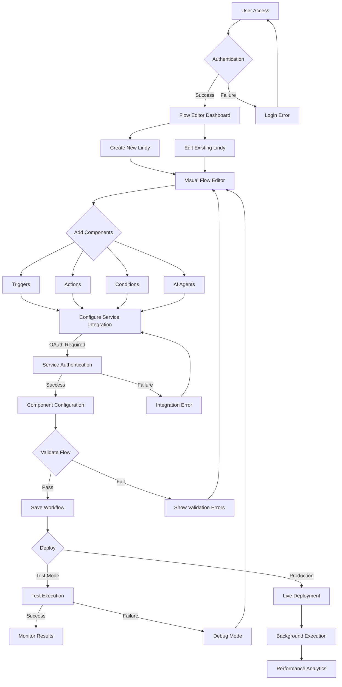
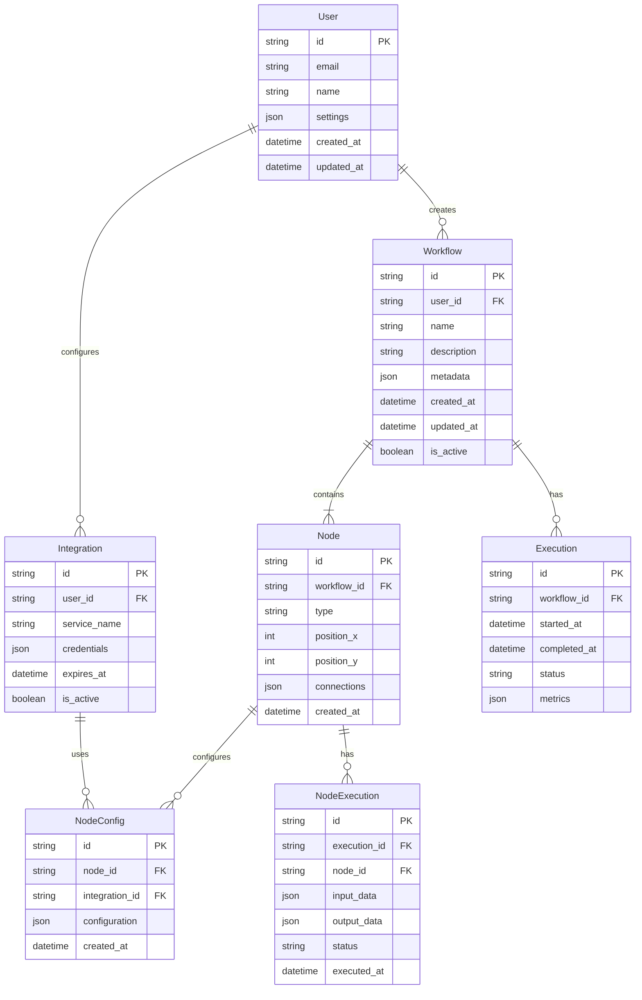
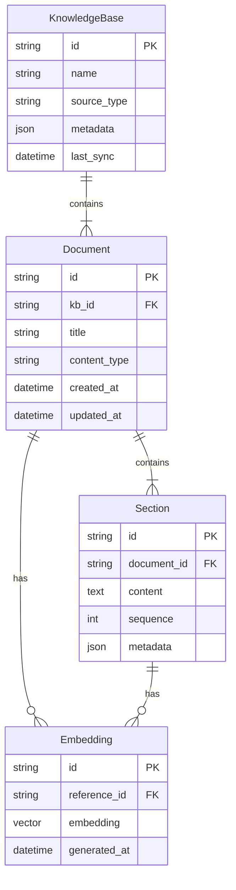
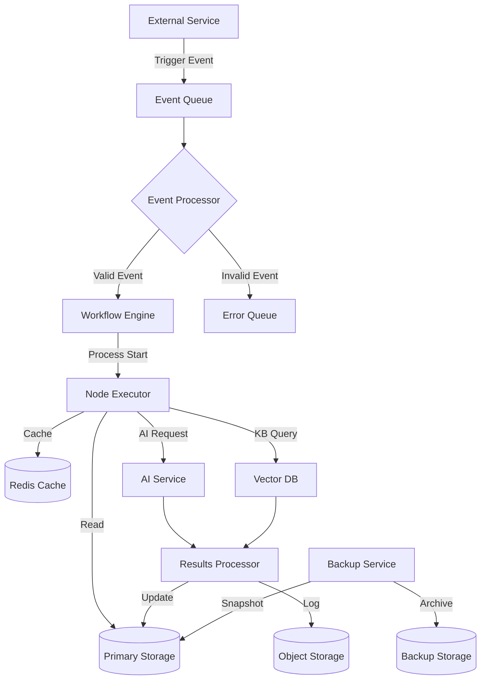

# Product Requirements Document (PRD)

# 1. INTRODUCTION

## 1.1 Purpose

This Product Requirements Document (PRD) specifies the functional and non-functional requirements for a no-code/low-code workflow automation platform. The document serves as a comprehensive reference for:

- Development teams implementing the platform features
- Product managers overseeing the development lifecycle
- QA engineers designing test cases and validation procedures
- Technical writers creating documentation
- Stakeholders evaluating project scope and progress

## 1.2 Scope

The workflow automation platform enables users to create, configure, and execute automated processes ("Lindies") through a visual interface without requiring programming knowledge. The system encompasses:

- Visual Flow Editor for drag-and-drop workflow creation
- Integration with 40+ external services and tools
- Event-based trigger system for workflow initiation
- Configurable actions for task execution
- Conditional logic for dynamic workflow branching
- AI agents for intelligent process automation
- Knowledge base search capabilities
- Enterprise-grade security and compliance features

Key benefits include:
- Reduced technical barriers for process automation
- Increased operational efficiency through streamlined workflows
- Enhanced process flexibility through visual programming
- Improved decision-making with AI-powered automation
- Secure integration with existing business tools and services
- Scalable architecture supporting growing automation needs

# 2. PRODUCT DESCRIPTION

## 2.1 Product Perspective

The workflow automation platform operates as a standalone SaaS solution while integrating seamlessly with existing enterprise systems and third-party services. The system architecture consists of:

- Cloud-based visual workflow editor
- Event monitoring and trigger management system
- Integration middleware for 40+ external services
- AI processing engine for intelligent automation
- Secure data storage and processing infrastructure
- RESTful APIs for extensibility and custom integrations

## 2.2 Product Functions

The platform provides the following core functions:

- Visual workflow creation and management through drag-and-drop interface
- Event-based workflow triggering from integrated services
- Automated action execution across connected platforms
- Conditional logic processing for dynamic workflow routing
- AI-powered decision making and task automation
- Knowledge base integration and intelligent search
- Workflow testing and validation
- Team collaboration and workflow sharing
- Usage analytics and performance monitoring
- Security and compliance management

## 2.3 User Characteristics

### Primary Users
- Business Analysts
  - Limited technical background
  - Focus on process optimization
  - Need for visual tools and templates

- Operations Managers
  - Medium technical proficiency
  - Emphasis on efficiency and automation
  - Require monitoring and reporting capabilities

### Secondary Users
- IT Administrators
  - High technical expertise
  - Responsible for security and integration
  - Need advanced configuration options

- Department Heads
  - Variable technical knowledge
  - Focus on team productivity
  - Require oversight and analytics

## 2.4 Constraints

### Technical Constraints
- Must maintain OAuth compliance for all service integrations
- 10-minute minimum polling interval for triggers
- Maximum workflow complexity limit of 100 nodes
- API rate limits for integrated services

### Security Constraints
- SOC2 and HIPAA compliance requirements
- Data encryption requirements for storage and transmission
- Multi-factor authentication requirement for enterprise users
- Regular security audit requirements

### Business Constraints
- Must support multiple browser versions
- 99.9% uptime SLA requirement
- Maximum 5-second response time for UI operations
- Support for minimum 10,000 concurrent users

## 2.5 Assumptions and Dependencies

### Assumptions
- Users have stable internet connectivity
- Integrated services maintain their current API structures
- Browser support for modern JavaScript features
- Users have necessary access permissions for integrated services

### Dependencies
- Third-party service availability
- OAuth provider uptime
- Cloud infrastructure reliability
- AI service provider availability
- SSL certificate validity
- DNS service reliability

# 3. PROCESS FLOWCHART

# 4. FUNCTIONAL REQUIREMENTS

## 4.1 Visual Flow Editor

### ID: FR-001
### Description
The Visual Flow Editor enables users to create and modify workflows through a drag-and-drop interface.
### Priority: High

| Requirement ID | Requirement Description | Acceptance Criteria |
|---------------|------------------------|-------------------|
| FR-001.1 | Canvas-based workspace for workflow design | - Resizable canvas with zoom controls - Grid snap functionality - Pan and scroll navigation |
| FR-001.2 | Drag-and-drop component library | - Categorized components panel - Search functionality - Component preview tooltips |
| FR-001.3 | Node connection system | - Visual connection lines between nodes - Auto-routing of connections - Connection validation |
| FR-001.4 | Component configuration panels | - Dynamic property fields - Input validation - Variable mapping interface |

## 4.2 Trigger System

### ID: FR-002
### Description
Event monitoring and trigger management system that initiates workflows based on external events.
### Priority: High

| Requirement ID | Requirement Description | Acceptance Criteria |
|---------------|------------------------|-------------------|
| FR-002.1 | Service polling mechanism | - Configurable polling intervals (min 10 minutes) - Event queue management - Error handling and retry logic |
| FR-002.2 | Trigger configuration | - Service-specific trigger options - Custom trigger conditions - Trigger testing interface |
| FR-002.3 | Event filtering | - Conditional event processing - Data transformation options - Duplicate event detection |
| FR-002.4 | Trigger monitoring | - Event logs - Trigger status dashboard - Alert system for failures |

## 4.3 Action System

### ID: FR-003
### Description
Execution engine for performing operations across integrated services and platforms.
### Priority: High

| Requirement ID | Requirement Description | Acceptance Criteria |
|---------------|------------------------|-------------------|
| FR-003.1 | Action execution engine | - Parallel execution support - Error handling - Timeout management |
| FR-003.2 | Service integration actions | - OAuth authentication - API rate limiting - Response handling |
| FR-003.3 | Data transformation | - Variable mapping - Format conversion - Template processing |
| FR-003.4 | Action history | - Execution logs - Performance metrics - Debug information |

## 4.4 Conditional Logic

### ID: FR-004
### Description
Decision-making system for dynamic workflow routing and data processing.
### Priority: Medium

| Requirement ID | Requirement Description | Acceptance Criteria |
|---------------|------------------------|-------------------|
| FR-004.1 | Condition editor | - Visual condition builder - Custom expression support - Variable reference system |
| FR-004.2 | Branching logic | - Multiple branch support - Default path handling - Branch merging |
| FR-004.3 | Data evaluation | - Type-safe comparisons - Complex logical operations - Array and object handling |
| FR-004.4 | Condition testing | - Test data input - Branch validation - Logic verification tools |

## 4.5 AI Agent System

### ID: FR-005
### Description
Integration of AI capabilities for intelligent automation and decision-making.
### Priority: High

| Requirement ID | Requirement Description | Acceptance Criteria |
|---------------|------------------------|-------------------|
| FR-005.1 | AI service integration | - Multiple AI provider support - Model selection interface - API key management |
| FR-005.2 | Skills library | - Predefined AI capabilities - Custom skill creation - Skill versioning |
| FR-005.3 | Context management | - Knowledge base integration - Context window configuration - Memory management |
| FR-005.4 | AI execution monitoring | - Performance tracking - Cost monitoring - Quality metrics |

## 4.6 Knowledge Base Integration

### ID: FR-006
### Description
System for accessing and searching external data sources and documentation.
### Priority: Medium

| Requirement ID | Requirement Description | Acceptance Criteria |
|---------------|------------------------|-------------------|
| FR-006.1 | Source integration | - Multiple source support - Authentication management - Index synchronization |
| FR-006.2 | Search functionality | - Full-text search - Filters and facets - Relevance ranking |
| FR-006.3 | Content processing | - Format conversion - Metadata extraction - Version tracking |
| FR-006.4 | Access control | - Permission management - Usage tracking - Content security |

# 5. NON-FUNCTIONAL REQUIREMENTS

## 5.1 Performance Requirements

| Requirement ID | Category | Description | Target Metric |
|---------------|-----------|-------------|---------------|
| NFR-001 | Response Time | Maximum time for UI operations | < 5 seconds |
| NFR-002 | API Latency | Maximum time for API responses | < 2 seconds |
| NFR-003 | Workflow Execution | Maximum time to start workflow after trigger | < 30 seconds |
| NFR-004 | Concurrent Users | System must support simultaneous users | 10,000 users |
| NFR-005 | Resource Usage | Maximum memory per workflow instance | < 512MB |
| NFR-006 | Database Performance | Query response time | < 100ms |
| NFR-007 | File Operations | Maximum file upload/download time | < 10 seconds for 100MB |

## 5.2 Safety Requirements

| Requirement ID | Category | Description | Implementation |
|---------------|-----------|-------------|----------------|
| NFR-008 | Data Backup | Regular automated backups | Every 6 hours |
| NFR-009 | Failure Recovery | System state recovery mechanism | Auto-recovery within 5 minutes |
| NFR-010 | Data Validation | Input validation for all user data | Pre-processing validation |
| NFR-011 | Error Handling | Graceful error management | User-friendly error messages |
| NFR-012 | Version Control | Workflow version history | 30-day retention |
| NFR-013 | Audit Trail | Activity logging for all operations | Detailed audit logs |

## 5.3 Security Requirements

| Requirement ID | Category | Description | Implementation |
|---------------|-----------|-------------|----------------|
| NFR-014 | Authentication | Multi-factor authentication | OAuth 2.0 + TOTP |
| NFR-015 | Authorization | Role-based access control | Granular permissions |
| NFR-016 | Data Encryption | Encryption at rest and in transit | AES-256 + TLS 1.3 |
| NFR-017 | Session Management | Secure session handling | JWT with expiration |
| NFR-018 | API Security | API authentication and rate limiting | API keys + OAuth |
| NFR-019 | Vulnerability Management | Regular security scanning | Weekly automated scans |
| NFR-020 | Data Privacy | Data anonymization and masking | PII protection |

## 5.4 Quality Requirements

| Requirement ID | Category | Description | Target Metric |
|---------------|-----------|-------------|---------------|
| NFR-021 | Availability | System uptime | 99.9% |
| NFR-022 | Maintainability | Code quality standards | 90% test coverage |
| NFR-023 | Usability | User satisfaction score | > 4.5/5.0 |
| NFR-024 | Scalability | Linear performance scaling | Up to 100K workflows |
| NFR-025 | Reliability | Mean time between failures | > 720 hours |
| NFR-026 | Recoverability | Recovery time objective | < 4 hours |
| NFR-027 | Modularity | Component independence | Low coupling |

## 5.5 Compliance Requirements

| Requirement ID | Category | Description | Standard |
|---------------|-----------|-------------|-----------|
| NFR-028 | Data Protection | GDPR compliance | EU GDPR |
| NFR-029 | Healthcare | HIPAA compliance | HIPAA |
| NFR-030 | Security Controls | SOC 2 Type II compliance | AICPA SOC 2 |
| NFR-031 | API Standards | RESTful API compliance | OpenAPI 3.0 |
| NFR-032 | Accessibility | Web accessibility standards | WCAG 2.1 Level AA |
| NFR-033 | Data Retention | Data retention policies | Industry-specific |
| NFR-034 | Audit Compliance | External audit readiness | Annual certification |

# 6. DATA REQUIREMENTS

## 6.1 Data Models

### 6.1.1 Core Entities

### 6.1.2 Knowledge Base Schema

## 6.2 Data Storage

### 6.2.1 Primary Storage
- PostgreSQL for relational data (users, workflows, configurations)
- Vector database (Pinecone) for embeddings and semantic search
- Redis for caching and temporary execution state
- Object storage (S3) for file attachments and logs

### 6.2.2 Data Retention
- Workflow execution history: 90 days
- System logs: 12 months
- User data: Retained until account deletion
- Temporary execution data: 24 hours
- Knowledge base snapshots: 30 days

### 6.2.3 Backup and Recovery
- Full database backups: Daily
- Incremental backups: Every 6 hours
- Point-in-time recovery capability: 30 days
- Cross-region backup replication
- Maximum recovery time objective (RTO): 4 hours
- Recovery point objective (RPO): 6 hours

## 6.3 Data Processing

### 6.3.1 Data Flow

### 6.3.2 Data Security
- Encryption at rest using AES-256
- TLS 1.3 for data in transit
- Field-level encryption for sensitive data
- Key rotation every 90 days
- Data masking for PII in logs
- Access control through role-based permissions
- Audit logging for all data modifications

### 6.3.3 Data Processing Rules
- Maximum single file size: 100MB
- Maximum batch processing size: 1000 records
- Rate limiting: 100 requests per minute per user
- Concurrent workflow limit: 25 per user
- Maximum execution time: 30 minutes per workflow
- Data transformation size limit: 10MB per node
- Knowledge base document limit: 1GB per base

# 7. EXTERNAL INTERFACES

## 7.1 User Interfaces

### 7.1.1 Flow Editor Interface

| Component | Description | Requirements |
|-----------|-------------|--------------|
| Canvas | Main workflow design area | - Minimum 1024x768 resolution - Support for touch and mouse input - Auto-save every 30 seconds |
| Component Panel | Left sidebar with available nodes | - Categorized node listing - Search and filter functionality - Drag-and-drop support |
| Properties Panel | Right sidebar for node configuration | - Dynamic form generation - Input validation - Variable mapping interface |
| Toolbar | Top navigation and actions | - Standard editing tools - Zoom controls - Undo/redo functionality |

### 7.1.2 Dashboard Interface

| Component | Description | Requirements |
|-----------|-------------|--------------|
| Workflow List | Overview of created workflows | - Grid and list view options - Sort and filter capabilities - Status indicators |
| Analytics Panel | Performance metrics display | - Real-time execution stats - Error rate visualization - Resource usage graphs |
| Integration Hub | Service connection management | - OAuth flow integration - Connection status monitoring - Credential management |

## 7.2 Software Interfaces

### 7.2.1 External Service Integration

| Service Type | Integration Method | Requirements |
|-------------|-------------------|--------------|
| Cloud Storage | REST API | - OAuth 2.0 authentication - Rate limiting: 100 req/min - Automatic retry logic |
| Email Services | SMTP/IMAP | - TLS encryption - DKIM support - SPF verification |
| Database Systems | Native Drivers | - Connection pooling - Prepared statements - Transaction management |
| AI Services | REST API | - API key management - Response streaming - Error handling |

### 7.2.2 Internal Service Integration

| Service | Protocol | Requirements |
|---------|----------|--------------|
| Vector Database | gRPC | - Binary serialization - Streaming support - Load balancing |
| Cache Layer | Redis Protocol | - Cluster support - Pub/sub capability - Persistence options |
| Message Queue | AMQP | - Guaranteed delivery - Dead letter queues - Priority handling |

## 7.3 Communication Interfaces

### 7.3.1 Network Protocols

| Protocol | Usage | Requirements |
|----------|-------|--------------|
| HTTPS | API Communication | - TLS 1.3 - Certificate pinning - HSTS support |
| WebSocket | Real-time Updates | - Secure WebSocket (wss) - Auto-reconnection - Heartbeat mechanism |
| gRPC | Internal Services | - HTTP/2 transport - Bi-directional streaming - Load balancing |

### 7.3.2 Data Formats

| Format | Usage | Requirements |
|--------|-------|--------------|
| JSON | API Payloads | - Schema validation - UTF-8 encoding - Size limit: 10MB |
| Protocol Buffers | Internal Communication | - Version compatibility - Custom type support - Backward compatibility |
| MessagePack | Binary Data | - Compression support - Streaming capability - Type safety |

## 7.4 Hardware Interfaces

### 7.4.1 Storage Systems

| Type | Interface | Requirements |
|------|-----------|--------------|
| Object Storage | S3 API | - Multi-part upload support - Versioning capability - Cross-region replication |
| Block Storage | iSCSI | - RAID configuration - Snapshot support - Auto-scaling |

### 7.4.2 Network Infrastructure

| Component | Interface | Requirements |
|-----------|-----------|--------------|
| Load Balancer | TCP/IP | - SSL termination - Health checking - Session persistence |
| CDN | HTTP/HTTPS | - Edge caching - DDOS protection - Geographic distribution |

# 8. APPENDICES

## 8.1 GLOSSARY

| Term | Definition |
|------|------------|
| Lindy | An automated workflow created within the platform that connects multiple services and executes predefined actions |
| Flow Editor | The visual interface where users create and modify workflows through drag-and-drop interactions |
| Node | A single component within a workflow that represents a trigger, action, condition, or AI agent |
| Skills | Pre-configured AI capabilities that can be added to workflows for intelligent automation |
| Knowledge Base | A collection of searchable information sources integrated into the platform |
| OAuth | An open standard authentication protocol used for secure service integration |
| Trigger | An event that initiates a workflow execution |
| Vector Database | A specialized database optimized for storing and searching high-dimensional vectors used in AI operations |

## 8.2 ACRONYMS

| Acronym | Expansion |
|---------|-----------|
| API | Application Programming Interface |
| HIPAA | Health Insurance Portability and Accountability Act |
| JWT | JSON Web Token |
| OAuth | Open Authorization |
| PII | Personally Identifiable Information |
| REST | Representational State Transfer |
| RTO | Recovery Time Objective |
| RPO | Recovery Point Objective |
| SaaS | Software as a Service |
| SOC2 | Service Organization Control 2 |
| SMTP | Simple Mail Transfer Protocol |
| TLS | Transport Layer Security |
| TOTP | Time-based One-Time Password |
| WCAG | Web Content Accessibility Guidelines |

## 8.3 ADDITIONAL REFERENCES

| Category | Reference | Description |
|----------|-----------|-------------|
| Security Standards | [SOC2 Compliance](https://www.aicpa.org/soc) | Details on SOC2 security requirements |
| API Documentation | [OpenAPI Specification](https://www.openapis.org) | REST API design standards |
| Authentication | [OAuth 2.0 Framework](https://oauth.net/2/) | OAuth implementation guidelines |
| Accessibility | [WCAG 2.1](https://www.w3.org/WAI/standards-guidelines/wcag/) | Web accessibility standards |
| Data Protection | [GDPR Documentation](https://gdpr.eu) | EU data protection requirements |
| Healthcare Compliance | [HIPAA Guidelines](https://www.hhs.gov/hipaa) | Healthcare data security standards |
| Vector Database | [Pinecone Documentation](https://www.pinecone.io/docs/) | Vector database implementation |
| Message Queue | [AMQP Protocol](https://www.amqp.org) | Message queue specifications |