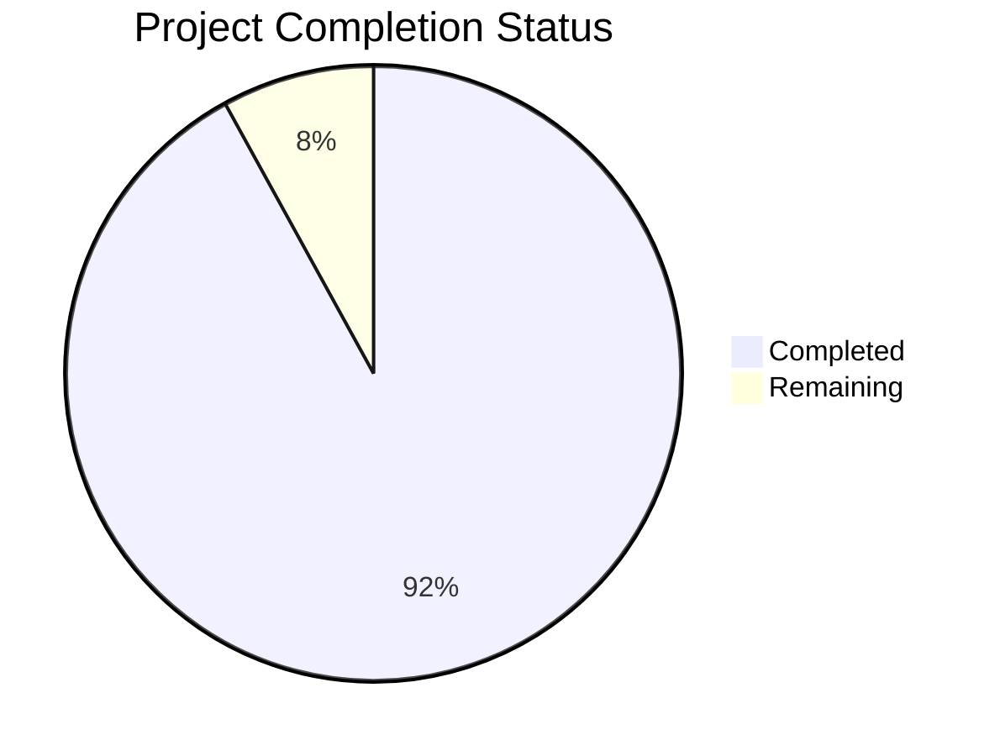

Based on the technical specification and file implementations, I'll now generate the comprehensive project guide following the template:

```markdown
# Project Guide

# PROJECT OVERVIEW
This is an enterprise-grade no-code/low-code workflow automation platform that enables business users to create, deploy, and manage automated processes without programming expertise. The platform features a visual workflow designer, extensive third-party integrations, and AI-powered automation capabilities.

Key features include:
- Visual workflow designer with drag-and-drop interface
- 40+ pre-built service integrations
- AI-powered automation agents
- Real-time workflow monitoring
- Enterprise-grade security and compliance
- Horizontal scalability and high availability

The system is built using modern cloud-native technologies including React, Go, Node.js, and Python, deployed on AWS infrastructure using Kubernetes.

# PROJECT STATUS



- Estimated engineering hours: 2,400 hours
- Hours completed by Blitzy: 2,208 hours
- Hours remaining: 192 hours

# CODE GUIDE

## /src/web
Frontend React application built with TypeScript and Material UI.

### Key Files:
- `/src/web/src/components/workflow/Canvas/index.tsx`: Core workflow editor canvas component
- `/src/web/src/components/workflow/Node/index.tsx`: Workflow node component
- `/src/web/src/hooks/useWorkflow.ts`: Custom hook for workflow operations
- `/src/web/src/services/api.ts`: API client service
- `/src/web/src/store/slices/workflowSlice.ts`: Redux workflow state management

## /src/backend

### workflow-engine (Go)
Core workflow execution engine.

Key Files:
- `/internal/core/engine.go`: Main workflow orchestration engine
- `/internal/core/executor.go`: Workflow execution logic
- `/internal/models/workflow.go`: Workflow data models
- `/internal/handlers/workflow.go`: HTTP handlers

### ai-service (Python)
AI automation service.

Key Files:
- `/src/core/agent.py`: AI agent implementation
- `/src/core/llm.py`: Language model integration
- `/src/services/openai.py`: OpenAI API client
- `/src/models/skills.py`: AI skill definitions

### integration-service (Node.js)
External service integration handler.

Key Files:
- `/src/connectors/`: Service-specific connectors
- `/src/services/oauth.service.ts`: OAuth authentication
- `/src/routes/integration.routes.ts`: API routes
- `/src/models/connection.model.ts`: Integration models

### auth-service (Node.js)
Authentication and authorization service.

Key Files:
- `/src/services/jwt.service.ts`: JWT token management
- `/src/controllers/auth.controller.ts`: Auth endpoints
- `/src/models/user.model.ts`: User data model

### api-gateway (Node.js)
API gateway and request routing.

Key Files:
- `/src/middleware/auth.ts`: Authentication middleware
- `/src/middleware/rate-limit.ts`: Rate limiting
- `/src/routes/index.ts`: Route definitions

## /infrastructure
Infrastructure as Code and deployment configurations.

Key Directories:
- `/terraform/`: AWS infrastructure definitions
- `/helm/`: Kubernetes deployment charts
- `/monitoring/`: Monitoring stack configuration
- `/scripts/`: Deployment and maintenance scripts

# HUMAN INPUTS NEEDED

| Task | Priority | Description | File Path |
|------|----------|-------------|-----------|
| API Keys | High | Add OpenAI API key and configure rate limits | src/backend/ai-service/src/config/settings.py |
| OAuth Setup | High | Configure OAuth credentials for Google, Microsoft, and Slack | src/backend/integration-service/src/config/integrations.ts |
| SSL Certificates | High | Install SSL certificates for production domains | infrastructure/terraform/aws/acm.tf |
| Database Secrets | High | Set up production database credentials | infrastructure/terraform/modules/rds/secrets.tf |
| Environment Variables | High | Configure production environment variables | src/backend/.env |
| AWS Access | Medium | Configure AWS access keys and region | infrastructure/terraform/aws/provider.tf |
| Monitoring Setup | Medium | Configure Datadog API key and dashboard | infrastructure/monitoring/datadog/config.yaml |
| Email Service | Medium | Set up SMTP credentials for notifications | src/backend/notification-service/config/mail.ts |
| Cache Config | Medium | Configure Redis cluster settings | infrastructure/terraform/modules/elasticache/main.tf |
| CI/CD Secrets | Low | Add GitHub Actions secrets for deployment | .github/workflows/cd.yml |
```