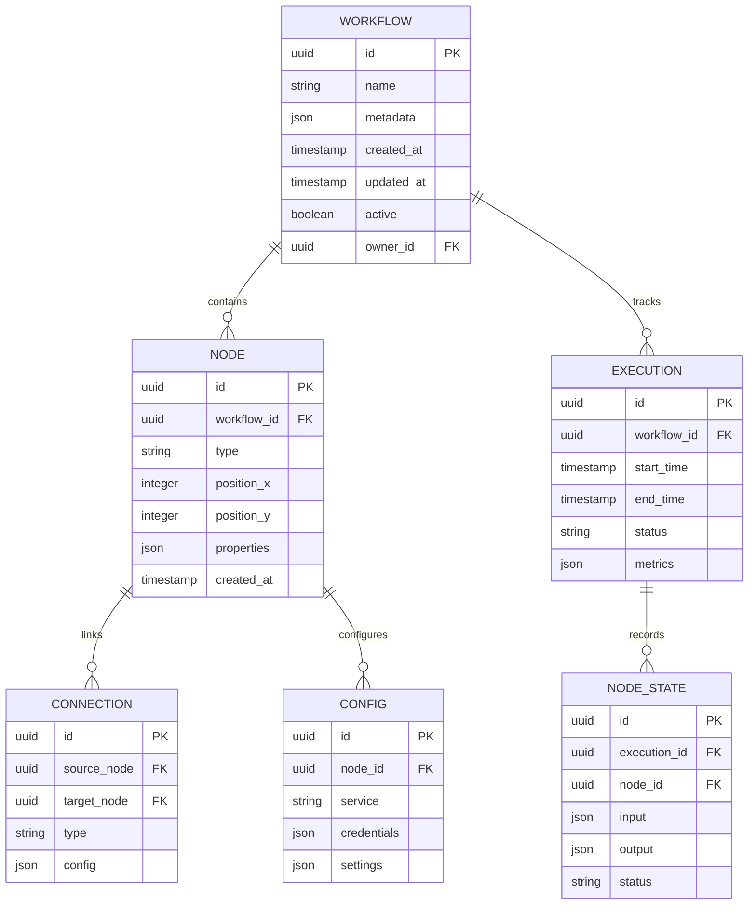

# Technical Specifications

# 1. INTRODUCTION

## 1.1 EXECUTIVE SUMMARY

The no-code/low-code workflow automation platform enables business users to create, deploy, and manage automated processes without programming expertise. By providing a visual interface for workflow design and extensive integration capabilities, the platform addresses the growing need for business process automation while reducing technical barriers and implementation costs. The system serves business analysts, operations managers, and department heads who need to streamline operations, while providing IT administrators with enterprise-grade security and control features. Through intelligent automation powered by AI agents and extensive third-party integrations, the platform is expected to reduce manual task overhead by 60% and accelerate process implementation by 80% compared to traditional development approaches.

## 1.2 SYSTEM OVERVIEW

### Project Context

| Aspect | Description |
| --- | --- |
| Market Position | Enterprise-grade workflow automation platform targeting mid to large organizations |
| Current Limitations | Manual processes requiring technical expertise for automation |
| Enterprise Integration | Seamless integration with existing business tools through 40+ pre-built connectors |

### High-Level Description

| Component | Description |
| --- | --- |
| Visual Flow Editor | Canvas-based interface for drag-and-drop workflow creation |
| Trigger System | Event monitoring and workflow initiation engine |
| Action Framework | Configurable task execution across integrated services |
| AI Engine | Intelligent automation through customizable AI agents |
| Integration Hub | Centralized connection management for external services |

### Success Criteria

| Metric | Target |
| --- | --- |
| Workflow Creation Time | 80% reduction vs. traditional development |
| User Adoption | 70% of target users actively creating workflows within 6 months |
| System Reliability | 99.9% uptime with sub-5-second response times |
| Integration Coverage | 40+ supported services with 99% API compatibility |

## 1.3 SCOPE

### In-Scope Elements

| Category | Components |
| --- | --- |
| Core Features | - Visual workflow designer<br>- Event-based triggers<br>- Service integrations<br>- AI agent capabilities<br>- Knowledge base search |
| User Groups | - Business analysts<br>- Operations managers<br>- IT administrators<br>- Department heads |
| Technical Requirements | - SOC2 compliance<br>- HIPAA compliance<br>- OAuth integration<br>- Real-time monitoring |
| Data Domains | - Business process data<br>- Integration metadata<br>- User configurations<br>- Execution logs |

### Out-of-Scope Elements

| Category | Exclusions |
| --- | --- |
| Features | - Custom code execution<br>- Native mobile applications<br>- Blockchain integration<br>- Legacy system connectors |
| Implementation | - On-premises deployment<br>- Custom hardware requirements<br>- Non-cloud storage options |
| Integrations | - Mainframe systems<br>- Custom protocol support<br>- Direct database connections |
| Use Cases | - Real-time trading systems<br>- Mission-critical medical systems<br>- High-frequency transactions |

# 2. SYSTEM ARCHITECTURE

## 2.1 High-Level Architecture

```mermaid
C4Context
    title System Context Diagram (Level 0)

    Person(user, "Platform User", "Business analyst, operations manager")
    Person(admin, "Administrator", "IT admin, system manager")
    
    System_Boundary(platform, "Workflow Automation Platform") {
        System(web, "Web Application", "Flow editor and management interface")
        System(engine, "Workflow Engine", "Process execution and orchestration")
        System(ai, "AI Engine", "Intelligent automation services")
        System(integration, "Integration Hub", "Service connection management")
    }

    System_Ext(external, "External Services", "Gmail, Sheets, Slack, etc.")
    System_Ext(ai_service, "AI Services", "OpenAI, Claude, etc.")
    System_Ext(storage, "Cloud Storage", "S3, GCS")
    
    Rel(user, web, "Creates and manages workflows", "HTTPS")
    Rel(admin, platform, "Configures and monitors", "HTTPS")
    Rel(web, engine, "Submits workflows", "gRPC")
    Rel(engine, integration, "Executes actions", "Internal API")
    Rel(engine, ai, "Requests processing", "Internal API")
    Rel(integration, external, "Connects services", "OAuth/REST")
    Rel(ai, ai_service, "Processes requests", "REST")
    Rel(platform, storage, "Stores data", "S3 API")
```

## 2.2 Container Architecture


## 2.3 Component Details

### 2.3.1 Frontend Components

| Component | Technology | Purpose | Scaling Strategy |
| --- | --- | --- | --- |
| Flow Editor | React, TypeScript | Visual workflow creation | Client-side rendering, CDN distribution |
| Admin Dashboard | React, TypeScript | System administration | Horizontal pod scaling |
| Real-time Updates | WebSocket | Live execution status | WebSocket clustering |

### 2.3.2 Backend Services

| Service | Technology | Responsibility | Scaling Approach |
| --- | --- | --- | --- |
| Workflow Engine | Go | Process orchestration | Horizontal scaling, sharding |
| Integration Hub | Node.js | Service connectivity | Pod auto-scaling |
| AI Engine | Python | Intelligent automation | GPU-optimized instances |
| Auth Service | Node.js | Security management | Regional deployment |

### 2.3.3 Data Storage

| Store Type | Technology | Purpose | Scaling Strategy |
| --- | --- | --- | --- |
| Primary DB | PostgreSQL | Workflow data | Master-replica replication |
| Cache | Redis | Session, execution state | Cluster sharding |
| Vector Store | Pinecone | AI embeddings | Cloud-managed scaling |
| Object Store | S3 | File storage | Multi-region replication |

## 2.4 Technical Decisions


## 2.5 Cross-Cutting Concerns

### 2.5.1 Monitoring Architecture


### 2.5.2 Deployment Architecture

```mermaid
C4Deployment
    title Deployment Diagram

    Deployment_Node(aws, "AWS Cloud") {
        Deployment_Node(vpc, "VPC") {
            Deployment_Node(eks, "EKS Cluster") {
                Container(api, "API Services", "Kubernetes Pods")
                Container(core, "Core Services", "Kubernetes Pods")
                Container(workers, "Worker Nodes", "Kubernetes Pods")
            }
            
            Deployment_Node(data, "Data Layer") {
                ContainerDb(rds, "RDS PostgreSQL", "Master-Replica")
                ContainerDb(elasticache, "ElastiCache Redis", "Cluster")
            }
        }
        
        Deployment_Node(edge, "Edge Services") {
            Container(cdn, "CloudFront", "CDN")
            Container(waf, "WAF", "Security")
        }
    }

    Rel(edge, eks, "Routes traffic", "HTTPS")
    Rel(eks, data, "Persists data", "Internal")
```

## 2.6 Error Handling and Recovery


# 3. SYSTEM COMPONENTS ARCHITECTURE

## 3.1 User Interface Design

### 3.1.1 Design System Specifications

| Category | Requirement | Details |
| --- | --- | --- |
| Visual Hierarchy | Material Design 3.0 | - 8px grid system<br>- Z-index layers (0-1000)<br>- Consistent spacing (8, 16, 24, 32px) |
| Component Library | Custom React Components | - Atomic design structure<br>- Storybook documentation<br>- Reusable patterns |
| Responsive Design | Mobile-first approach | - Breakpoints: 320px, 768px, 1024px, 1440px<br>- Fluid typography<br>- Flexible layouts |
| Accessibility | WCAG 2.1 Level AA | - ARIA labels<br>- Keyboard navigation<br>- Screen reader support |
| Browser Support | Modern browsers | - Chrome 90+<br>- Firefox 88+<br>- Safari 14+<br>- Edge 90+ |
| Theming | Dark/Light modes | - System preference detection<br>- Manual override<br>- Theme persistence |
| Internationalization | Multi-language support | - RTL support<br>- Dynamic content loading<br>- Date/number formatting |

### 3.1.2 Interface Layout


### 3.1.3 Critical User Flows


## 3.2 Database Design

### 3.2.1 Schema Design


### 3.2.2 Data Management Strategy

| Aspect | Strategy | Implementation |
| --- | --- | --- |
| Partitioning | Time-based | - Monthly workflow execution partitions<br>- User-based tenant partitioning |
| Indexing | Performance-optimized | - B-tree indexes for lookups<br>- GiST indexes for JSON<br>- Partial indexes for active records |
| Caching | Multi-level | - Redis L1 cache (5min TTL)<br>- PostgreSQL materialized views<br>- CDN for static assets |
| Backup | Continuous | - WAL archiving<br>- Daily full backups<br>- Cross-region replication |
| Retention | Policy-based | - Execution data: 90 days<br>- Audit logs: 1 year<br>- User data: 7 years |

## 3.3 API Design

### 3.3.1 API Architecture


### 3.3.2 API Specifications

| Category | Specification | Details |
| --- | --- | --- |
| Protocol | REST/HTTP/2 | - TLS 1.3 required<br>- Keep-alive connections<br>- HTTP/2 multiplexing |
| Authentication | OAuth 2.0 + JWT | - Bearer token authentication<br>- Refresh token rotation<br>- Scope-based access |
| Rate Limiting | Token bucket | - 100 requests/minute per user<br>- Burst allowance: 20 requests<br>- Rate limit headers |
| Versioning | URL-based | - /v1/, /v2/ prefixes<br>- Deprecation notices<br>- Version sunset policy |
| Documentation | OpenAPI 3.0 | - Interactive documentation<br>- Code samples<br>- SDK generation |

### 3.3.3 Integration Patterns


# 4. TECHNOLOGY STACK

## 4.1 PROGRAMMING LANGUAGES

| Platform/Component | Language & Version | Justification |
| --- | --- | --- |
| Backend Services | Go 1.21 | - High performance for concurrent operations<br>- Strong typing for reliability<br>- Excellent standard library<br>- Built-in testing framework |
| API Layer | Node.js 20 LTS | - Extensive ecosystem for API development<br>- Async I/O optimization<br>- Native JSON handling<br>- Strong OAuth library support |
| AI Services | Python 3.11 | - Rich AI/ML library ecosystem<br>- LangChain compatibility<br>- Excellent vector computation<br>- Native async support |
| Frontend | TypeScript 5.0 | - Type safety for large applications<br>- Enhanced IDE support<br>- Better maintainability<br>- React ecosystem compatibility |

## 4.2 FRAMEWORKS & LIBRARIES

### Backend Frameworks

| Component | Framework | Version | Justification |
| --- | --- | --- | --- |
| Core Services | Go Fiber | 2.50.0 | - High-performance HTTP server<br>- Express-like syntax<br>- Built-in middleware<br>- Zero memory allocation |
| API Gateway | Kong | 3.4 | - Enterprise-grade API management<br>- Plugin ecosystem<br>- Advanced rate limiting<br>- OAuth integration |
| AI Processing | FastAPI | 0.104.0 | - Async support for AI operations<br>- OpenAPI documentation<br>- WebSocket support<br>- High performance |

### Frontend Frameworks

| Component | Framework | Version | Justification |
| --- | --- | --- | --- |
| Web Application | React | 18.2.0 | - Component reusability<br>- Virtual DOM performance<br>- Large ecosystem<br>- Strong community support |
| State Management | Redux Toolkit | 1.9.7 | - Predictable state updates<br>- DevTools integration<br>- Middleware support<br>- TypeScript support |
| UI Components | Material UI | 5.14.0 | - Enterprise-ready components<br>- Customization options<br>- Accessibility support<br>- Responsive design |

## 4.3 DATABASES & STORAGE


### Storage Solutions

| Type | Technology | Version | Purpose |
| --- | --- | --- | --- |
| Primary Database | PostgreSQL | 15.0 | - Workflow and user data<br>- ACID compliance<br>- JSON support |
| Cache | Redis Cluster | 7.2 | - Session management<br>- Task queue<br>- Real-time data |
| Vector Database | Pinecone | Enterprise | - AI embeddings<br>- Semantic search<br>- Knowledge base |
| Object Storage | AWS S3 | - | - File storage<br>- Log archives<br>- Backups |

## 4.4 THIRD-PARTY SERVICES


### Service Integration Matrix

| Category | Service | Purpose | SLA Requirement |
| --- | --- | --- | --- |
| Authentication | Auth0 2.0 | Identity management | 99.99% |
| Monitoring | Datadog | Performance monitoring | 99.9% |
| Error Tracking | Sentry | Error reporting | 99.9% |
| CDN | CloudFlare Enterprise | Content delivery | 99.99% |
| AI Services | OpenAI API | Language processing | 99.9% |
| Cloud Platform | AWS | Infrastructure | 99.99% |

## 4.5 DEVELOPMENT & DEPLOYMENT


### Development Tools

| Category | Tool | Version | Purpose |
| --- | --- | --- | --- |
| IDE | VSCode | Latest | Development environment |
| Version Control | Git | 2.42.0 | Source control |
| Container Runtime | Docker | 24.0.6 | Containerization |
| Orchestration | Kubernetes | 1.28 | Container orchestration |
| CI/CD | GitHub Actions | - | Automation pipeline |
| IaC | Terraform | 1.6.0 | Infrastructure management |
| API Testing | Postman | Latest | API development |
| Monitoring | Prometheus | 2.47.0 | Metrics collection |

# 5. SYSTEM DESIGN

## 5.1 USER INTERFACE DESIGN

### 5.1.1 Flow Editor Layout


### 5.1.2 Component Specifications

| Component | Specifications | Interactions |
| --- | --- | --- |
| Top Navigation | - Height: 64px<br>- Fixed position<br>- Dark theme | - Save/Load workflows<br>- Undo/Redo<br>- Deploy options |
| Component Library | - Width: 280px<br>- Collapsible<br>- Scrollable | - Drag-and-drop nodes<br>- Search filtering<br>- Category expansion |
| Canvas Area | - Responsive width<br>- Infinite canvas<br>- Grid snap | - Node placement<br>- Connection drawing<br>- Pan/Zoom |
| Properties Panel | - Width: 320px<br>- Dynamic height<br>- Sticky header | - Form inputs<br>- Validation feedback<br>- Quick actions |

## 5.2 DATABASE DESIGN

### 5.2.1 Schema Design



### 5.2.2 Data Storage Strategy

| Storage Type | Technology | Purpose | Scaling Strategy |
| --- | --- | --- | --- |
| Primary Database | PostgreSQL 15 | Workflow and execution data | - Horizontal sharding<br>- Read replicas<br>- WAL archiving |
| Cache Layer | Redis 7.2 | Session and state management | - Cluster mode<br>- Sentinel failover<br>- Memory optimization |
| Vector Store | Pinecone | AI embeddings and search | - Managed scaling<br>- Index partitioning<br>- Query optimization |
| Object Storage | AWS S3 | File attachments and logs | - Bucket versioning<br>- Lifecycle policies<br>- Cross-region replication |

## 5.3 API DESIGN

### 5.3.1 API Architecture


### 5.3.2 API Endpoints

| Service | Endpoint | Method | Purpose |
| --- | --- | --- | --- |
| Workflow | /api/v1/workflows | POST | Create new workflow |
| Workflow | /api/v1/workflows/{id} | GET | Retrieve workflow |
| Workflow | /api/v1/workflows/{id}/deploy | POST | Deploy workflow |
| Execution | /api/v1/executions | GET | List executions |
| Execution | /api/v1/executions/{id}/status | GET | Get execution status |
| Integration | /api/v1/integrations | GET | List available integrations |
| Integration | /api/v1/integrations/{service}/auth | POST | Authenticate service |

### 5.3.3 API Security


### 5.3.4 Integration Patterns

| Pattern | Implementation | Use Case |
| --- | --- | --- |
| Request-Response | REST/HTTP | Synchronous operations |
| Event-Driven | RabbitMQ | Asynchronous processing |
| Streaming | WebSocket | Real-time updates |
| Batch Processing | Message Queue | Bulk operations |
| Circuit Breaker | Resilience4j | Fault tolerance |
| Rate Limiting | Token bucket | API protection |

# 6. USER INTERFACE DESIGN

## 6.1 Design System

| Element | Specification | Implementation |
| --- | --- | --- |
| Typography | System font stack | - Headers: -apple-system, 16-24px<br>- Body: system-ui, 14px<br>- Monospace: SF Mono, 13px |
| Colors | Material Design 3.0 | - Primary: #2196F3<br>- Secondary: #FF4081<br>- Error: #F44336<br>- Success: #4CAF50 |
| Spacing | 8px grid system | - Base unit: 8px<br>- Components: 16px<br>- Sections: 24px<br>- Pages: 32px |
| Elevation | 5 z-index levels | - Modal: 1000<br>- Dropdown: 100<br>- Header: 10<br>- Content: 1<br>- Background: 0 |

## 6.2 Main Dashboard

```
+----------------------------------------------------------+
|  [#] Workflow Automation     [@] Profile    [?] Help  [=]  |
+----------------------------------------------------------+
|                                                           |
|  [*] My Workflows                     [Search...]  [+]    |
|  +--------------------------------------------------+    |
|  | Name         Status    Last Run     Actions       |    |
|  |--------------------------------------------------|    |
|  | Email Parse  [====]   2h ago       [Edit] [>]    |    |
|  | Data Sync    [====]   1d ago       [Edit] [>]    |    |
|  | AI Process   [!]      Failed       [Edit] [>]    |    |
|  +--------------------------------------------------+    |
|                                                           |
|  [i] Recent Activity                                      |
|  +--------------------------------------------------+    |
|  | • Email Parse completed successfully (2h ago)     |    |
|  | • AI Process failed - Check logs (3h ago)        |    |
|  | • New version available (1d ago)                 |    |
|  +--------------------------------------------------+    |
|                                                           |
+----------------------------------------------------------+
```

## 6.3 Flow Editor

```
+----------------------------------------------------------+
|  [<] Back    My Workflow    [Test] [Save] [Deploy]        |
+----------------------------------------------------------+
| Components  |                                    | Config  |
| [Search..] |                                    | +-----+ |
| Triggers   |          Main Canvas               | |Name | |
| +--Gmail   |     +----------------+             | |[..]| |
| +--Sheets  |     |   Start Here   |             | +-----+ |
| Actions    |     |      [+]       |             |        |
| +--Email   |     +----------------+             | Props  |
| +--Slack   |            |                       | ( )Get |
| +--Drive   |            v                       | ( )Set |
| AI Agents  |     +----------------+             |        |
| +--Parse   |     |   Add Action   |             | Auth   |
| +--Analyze |     |      [+]       |             | [^]    |
|            |     +----------------+             |        |
+------------+                                    +--------+
```

## 6.4 Integration Hub

```
+----------------------------------------------------------+
|  Integrations                          [Search...]         |
+----------------------------------------------------------+
|  Connected Services                                        |
|  +--------------------------------------------------+    |
|  | [v] Gmail                                         |    |
|  |     Connected as: user@domain.com                 |    |
|  |     [Disconnect] [Refresh Token]                  |    |
|  |                                                   |    |
|  | [v] Google Sheets                                 |    |
|  |     Connected as: user@domain.com                 |    |
|  |     [Disconnect] [Refresh Token]                  |    |
|  +--------------------------------------------------+    |
|                                                           |
|  Available Integrations                                   |
|  +--------------------------------------------------+    |
|  | [$] Stripe          [Connect]                     |    |
|  | [@] Slack           [Connect]                     |    |
|  | [#] Trello          [Connect]                     |    |
|  +--------------------------------------------------+    |
+----------------------------------------------------------+
```

## 6.5 Node Configuration

```
+----------------------------------------------------------+
|  Configure Node: Email Parser                              |
+----------------------------------------------------------+
|  Input Configuration                                       |
|  +--------------------------------------------------+    |
|  | Source Email                                      |    |
|  | [...........................] [Test Connection]   |    |
|  |                                                   |    |
|  | Filter Criteria                                   |    |
|  | [x] Subject Contains: [......................]    |    |
|  | [ ] From Address: [......................]        |    |
|  | [ ] Has Attachments                              |    |
|  +--------------------------------------------------+    |
|                                                           |
|  AI Configuration                                         |
|  +--------------------------------------------------+    |
|  | Extraction Model                                  |    |
|  | [v] GPT-4 (Advanced)                             |    |
|  |                                                   |    |
|  | Fields to Extract                                |    |
|  | [x] Customer Name                                |    |
|  | [x] Order Number                                 |    |
|  | [ ] Custom Fields: [......................]      |    |
|  +--------------------------------------------------+    |
|                                                           |
|  [Cancel]                              [Test] [Save]      |
+----------------------------------------------------------+
```

## 6.6 Key/Legend

| Symbol | Meaning |
| --- | --- |
| \[#\] | Dashboard/Menu icon |
| \[@\] | User/Profile icon |
| \[?\] | Help icon |
| \[=\] | Settings icon |
| \[+\] | Add/Create action |
| \[\<\] | Back/Previous navigation |
| \[\>\] | Forward/Next navigation |
| \[x\] | Close/Delete action |
| \[!\] | Warning/Error indicator |
| \[^\] | Upload action |
| \[$\] | Payment/Financial service |
| \[\*\] | Favorite/Important marker |
| \[...\] | Text input field |
| \[v\] | Dropdown menu |
| \[====\] | Progress indicator |
| ( ) | Radio button |
| \[x\] | Checked checkbox |
| \[ \] | Unchecked checkbox |
| +--+ | Container border |
| | | Vertical separator |
| • | Bullet point |

# 7. SECURITY CONSIDERATIONS

## 7.1 AUTHENTICATION AND AUTHORIZATION

### 7.1.1 Authentication Flow


### 7.1.2 Authorization Matrix

| Role | Workflow Creation | Integration Management | Team Management | System Settings | Analytics |
| --- | --- | --- | --- | --- | --- |
| Admin | Full Access | Full Access | Full Access | Full Access | Full Access |
| Team Lead | Create/Edit/Delete | Configure/View | Create/Edit | View Only | Full Access |
| Developer | Create/Edit | Configure/View | View Only | No Access | View Own |
| Analyst | Create/Edit | View Only | No Access | No Access | View Own |
| Viewer | View Only | No Access | No Access | No Access | View Own |

## 7.2 DATA SECURITY

### 7.2.1 Encryption Standards

| Data State | Encryption Method | Key Management | Rotation Policy |
| --- | --- | --- | --- |
| Data at Rest | AES-256-GCM | AWS KMS | 90 days |
| Data in Transit | TLS 1.3 | Managed Certificates | 1 year |
| Database | Column-level Encryption | Hardware Security Module | 180 days |
| Secrets | Vault (AES-256) | Multi-key Encryption | 30 days |
| File Storage | S3 Server-side Encryption | S3-managed Keys | 90 days |

### 7.2.2 Data Classification


## 7.3 SECURITY PROTOCOLS

### 7.3.1 Access Control Measures

| Control Type | Implementation | Monitoring |
| --- | --- | --- |
| Network Access | WAF + VPC | Real-time threat detection |
| API Access | OAuth 2.0 + API Keys | Rate limiting and logging |
| Database Access | IAM + Network Policies | Query auditing |
| Service Access | Service Mesh + mTLS | Traffic monitoring |
| Admin Access | MFA + IP Whitelist | Activity logging |

### 7.3.2 Security Monitoring

```mermaid
flowchart TD
    A[Security Events] --> B{SIEM System}
    B --> C[Log Analysis]
    B --> D[Threat Detection]
    B --> E[Compliance Monitoring]
    
    C --> F[Alert Generation]
    D --> F
    E --> F
    
    F --> G{Severity Level}
    G -->|High| H[Immediate Response]
    G -->|Medium| I[Investigation Queue]
    G -->|Low| J[Regular Review]
    
    H --> K[Incident Response]
    I --> K
    J --> L[Security Reports]
```

### 7.3.3 Compliance Requirements

| Standard | Requirements | Implementation |
| --- | --- | --- |
| SOC2 | Access Controls | - Role-based access<br>- Audit logging<br>- Regular reviews |
| HIPAA | Data Protection | - Encryption at rest/transit<br>- Access tracking<br>- Data retention policies |
| GDPR | Privacy Controls | - Data minimization<br>- Right to erasure<br>- Consent management |
| PCI DSS | Payment Security | - Network segmentation<br>- Encryption standards<br>- Vulnerability scanning |

### 7.3.4 Security Testing

| Test Type | Frequency | Tools/Methods |
| --- | --- | --- |
| Penetration Testing | Quarterly | - Automated scanning<br>- Manual testing<br>- Red team exercises |
| Vulnerability Scanning | Weekly | - OWASP ZAP<br>- Nessus<br>- Custom scripts |
| Security Reviews | Monthly | - Code analysis<br>- Configuration review<br>- Access audit |
| Compliance Audits | Annually | - External auditors<br>- Internal assessment<br>- Gap analysis |

# 8. INFRASTRUCTURE

## 8.1 DEPLOYMENT ENVIRONMENT

| Environment | Type | Purpose | Requirements |
| --- | --- | --- | --- |
| Production | Cloud-native | Live system deployment | - High availability<br>- Auto-scaling<br>- Multi-region support |
| Staging | Cloud | Pre-production testing | - Production parity<br>- Isolated data<br>- Feature testing |
| Development | Hybrid | Development and testing | - Local development support<br>- Cloud service access<br>- Fast iteration |
| DR Site | Cloud | Disaster recovery | - Cross-region deployment<br>- Data replication<br>- Failover capability |

## 8.2 CLOUD SERVICES

```mermaid
graph TB
    subgraph AWS Cloud Services
        A[Compute] --> A1[EKS]
        A --> A2[Lambda]
        A --> A3[EC2]
        
        B[Storage] --> B1[S3]
        B --> B2[EBS]
        B --> B3[EFS]
        
        C[Database] --> C1[RDS PostgreSQL]
        C --> C2[ElastiCache]
        C --> C3[DynamoDB]
        
        D[Network] --> D1[Route 53]
        D --> D2[CloudFront]
        D --> D3[VPC]
        
        E[Security] --> E1[WAF]
        E --> E2[KMS]
        E --> E3[Secrets Manager]
    end
```

| Service Category | AWS Service | Purpose | Justification |
| --- | --- | --- | --- |
| Container Orchestration | EKS | Kubernetes management | Production-grade container orchestration with managed control plane |
| Serverless | Lambda | Event processing | Cost-effective processing for triggers and background tasks |
| Database | RDS PostgreSQL | Primary data store | Enterprise-grade relational database with high availability |
| Caching | ElastiCache | Redis cluster | In-memory caching and session management |
| Storage | S3 | Object storage | Scalable storage for files and backups |
| CDN | CloudFront | Content delivery | Global content distribution and edge caching |
| DNS | Route 53 | DNS management | Reliable DNS with health checking and failover |
| Security | WAF, KMS | Security services | Enterprise-grade security and encryption management |

## 8.3 CONTAINERIZATION

```mermaid
graph LR
    subgraph Container Architecture
        A[Base Images] --> B[Service Images]
        B --> C[Runtime Containers]
        
        D[Configuration] --> C
        E[Secrets] --> C
        F[Volumes] --> C
    end
    
    subgraph Base Images
        A1[Node.js]
        A2[Python]
        A3[Go]
    end
    
    subgraph Service Images
        B1[API Services]
        B2[Worker Services]
        B3[AI Services]
    end
```

| Component | Technology | Configuration |
| --- | --- | --- |
| Container Runtime | Docker | - Version: 24.0.6<br>- BuildKit enabled<br>- Multi-stage builds |
| Base Images | Alpine Linux | - Minimal footprint<br>- Security hardened<br>- Regular updates |
| Image Registry | ECR | - Vulnerability scanning<br>- Image signing<br>- RBAC controls |
| Build Process | Docker Compose | - Local development<br>- Service dependencies<br>- Volume mapping |

## 8.4 ORCHESTRATION

```mermaid
graph TB
    subgraph Kubernetes Architecture
        A[Ingress] --> B[Services]
        B --> C[Deployments]
        C --> D[Pods]
        
        E[ConfigMaps] --> D
        F[Secrets] --> D
        G[Volumes] --> D
        
        H[HPA] --> C
        I[PDB] --> C
    end
```

| Component | Purpose | Configuration |
| --- | --- | --- |
| Cluster | EKS 1.28 | - Multi-AZ deployment<br>- Managed node groups<br>- Spot instances |
| Networking | Calico CNI | - Network policies<br>- Pod security<br>- Traffic encryption |
| Ingress | NGINX Ingress | - TLS termination<br>- Rate limiting<br>- WAF integration |
| Monitoring | Prometheus/Grafana | - Metrics collection<br>- Alert management<br>- Dashboards |

## 8.5 CI/CD PIPELINE

```mermaid
flowchart LR
    A[Source Code] --> B[Build]
    B --> C[Test]
    C --> D[Security Scan]
    D --> E[Artifact Creation]
    E --> F[Deploy Staging]
    F --> G[Integration Tests]
    G --> H[Deploy Production]
    
    subgraph Environments
        F --> F1[Staging]
        H --> H1[Production]
    end
    
    subgraph Monitoring
        I[Metrics] --> J[Alerts]
        K[Logs] --> J
        L[Traces] --> J
    end
```

| Stage | Tools | Configuration |
| --- | --- | --- |
| Source Control | GitHub | - Branch protection<br>- Required reviews<br>- Status checks |
| CI Pipeline | GitHub Actions | - Matrix builds<br>- Caching<br>- Parallel testing |
| Artifact Management | ECR, S3 | - Version tagging<br>- Immutable tags<br>- Retention policies |
| Deployment | ArgoCD | - GitOps workflow<br>- Automated rollbacks<br>- Progressive delivery |
| Security | Snyk, SonarQube | - Vulnerability scanning<br>- Code quality<br>- License compliance |

# 8. APPENDICES

## 8.1 ADDITIONAL TECHNICAL INFORMATION

### 8.1.1 Service Integration Capabilities

| Service Category | Integration Type | Authentication | Rate Limits |
| --- | --- | --- | --- |
| Email Services | SMTP/IMAP/API | OAuth 2.0 | 100 req/min |
| Cloud Storage | REST API | OAuth 2.0 | 1000 req/hour |
| Project Management | REST API | OAuth 2.0/API Key | 500 req/min |
| Communication | WebSocket/REST | OAuth 2.0 | 200 req/min |
| AI Services | REST API | API Key | 60 req/min |
| Database | Native/REST | OAuth 2.0/API Key | 1000 req/min |

### 8.1.2 AI Agent Skills Framework

```mermaid
mindmap
    root((AI Skills))
        Text Processing
            Summarization
            Translation
            Sentiment Analysis
            Entity Extraction
        Decision Making
            Conditional Logic
            Pattern Recognition
            Risk Assessment
        Data Analysis
            Trend Detection
            Anomaly Detection
            Statistical Analysis
        Knowledge Base
            Semantic Search
            Context Understanding
            Document Analysis
```

## 8.2 GLOSSARY

| Term | Definition |
| --- | --- |
| Action Node | A workflow component that executes specific operations within integrated services |
| Condition Node | A decision point in the workflow that determines the execution path based on criteria |
| Flow Editor | Visual interface for creating and modifying workflow automations |
| Integration Hub | Centralized management interface for external service connections |
| Knowledge Base | Searchable repository of information accessible to workflows and AI agents |
| Lindy | An individual automated workflow instance within the platform |
| Node | Basic building block of a workflow representing triggers, actions, or conditions |
| Skills Library | Collection of pre-configured AI capabilities available for workflow automation |
| Trigger Node | Component that initiates workflow execution based on external events |
| Vector Store | Database optimized for storing and querying AI embeddings and semantic data |
| Workflow Canvas | Interactive area where workflows are visually designed and connected |
| Workflow Engine | Core system component responsible for executing automated processes |

## 8.3 ACRONYMS

| Acronym | Full Form |
| --- | --- |
| AI | Artificial Intelligence |
| AMQP | Advanced Message Queuing Protocol |
| API | Application Programming Interface |
| CDN | Content Delivery Network |
| GDPR | General Data Protection Regulation |
| gRPC | Google Remote Procedure Call |
| HIPAA | Health Insurance Portability and Accountability Act |
| HSTS | HTTP Strict Transport Security |
| IMAP | Internet Message Access Protocol |
| JWT | JSON Web Token |
| MFA | Multi-Factor Authentication |
| OAuth | Open Authorization |
| PII | Personally Identifiable Information |
| RBAC | Role-Based Access Control |
| REST | Representational State Transfer |
| RTO | Recovery Time Objective |
| SaaS | Software as a Service |
| SMTP | Simple Mail Transfer Protocol |
| SOC2 | Service Organization Control 2 |
| SSL | Secure Sockets Layer |
| TLS | Transport Layer Security |
| TOTP | Time-based One-Time Password |
| VPC | Virtual Private Cloud |
| WAF | Web Application Firewall |
| WCAG | Web Content Accessibility Guidelines |

## 8.4 DEPENDENCY MATRIX

```mermaid
graph TD
    subgraph Frontend Dependencies
        A[React 18.2.0] --> B[TypeScript 5.0]
        A --> C[Redux Toolkit 1.9.7]
        A --> D[Material UI 5.14.0]
    end
    
    subgraph Backend Dependencies
        E[Go 1.21] --> F[Fiber 2.50.0]
        G[Node.js 20 LTS] --> H[Express 4.18]
        I[Python 3.11] --> J[FastAPI 0.104.0]
    end
    
    subgraph Infrastructure Dependencies
        K[Docker 24.0.6] --> L[Kubernetes 1.28]
        M[PostgreSQL 15.0] --> N[TimescaleDB]
        O[Redis 7.2] --> P[Redis Cluster]
    end
```